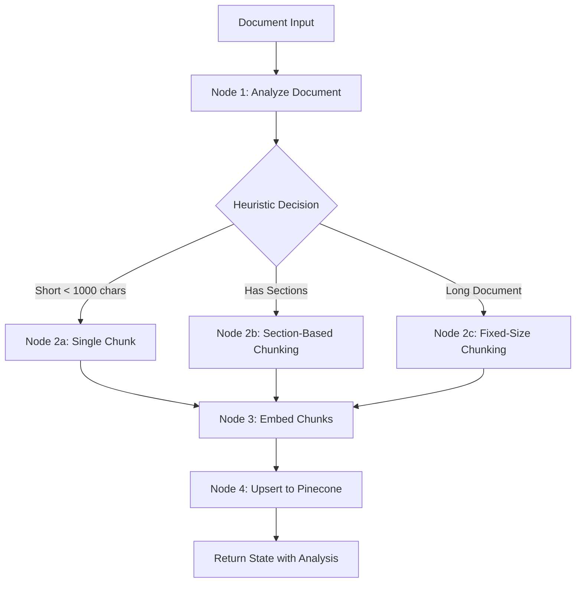

# AI Automation Testing Platform

A comprehensive AI-powered automation testing platform that combines document intelligence, vector search, structured data querying, and Jira integration to provide intelligent answers from multiple data sources.

## 🎯 Overview

This platform is designed as a **multi-source RAG system** where ALL data sources should be indexed in the vector database for unified semantic search.

**RAG Layer Implementation (Multi-Source):**
- **Uploaded Documents** → Extract → Chunk → Embed → Pinecone ✅ **IMPLEMENTED**
- **PostgreSQL Database** → Extract → Chunk → Embed → Pinecone ✅ **IMPLEMENTED**
- **Jira Issues** → Extract → Chunk → Embed → Pinecone ⚠️ **NOT IMPLEMENTED** (not required)

**Current Implementation Status:**
- ✅ **Documents**: Properly indexed via LangGraph workflow
- ✅ **PostgreSQL**: Indexed in Pinecone via postgres_indexer.py (Full RAG)
- ❌ **Jira**: Direct API calls (not part of RAG layer - excluded from scope)

**How RAG Should Work:**
1. **Indexing Phase**: Extract data from ALL sources → Chunk → Embed → Store in Pinecone
2. **Query Phase**: User query → Embed → Search Pinecone only → Retrieve relevant chunks from ALL sources
3. **Update Phase**: When data changes in any source → Re-index affected data → Update Pinecone

**Current Limitation**: Only documents go through proper RAG pipeline. PostgreSQL and Jira need indexing pipelines to complete the RAG architecture.

## ✨ Key Features

### 1. **Document Management**
- Upload documents (PDF, DOCX, TXT) to MongoDB with GridFS
- Automatic text extraction and parsing
- Tag-based organization and metadata support
- Secure file download

### 2. **Intelligent Document Processing (LangGraph Workflow)**
- **Sequential State-Based Workflow**: Processes uploaded documents through defined nodes
- **Scope**: Document processing only (NOT query-time operations)
- **Smart Chunking Strategy Selection**:
  - Single chunk for short documents (< 1000 chars)
  - Section-based chunking for structured documents
  - Fixed-size chunking with overlap for long documents
- **Workflow Nodes**:
  1. **Analyze Document**: Examines length, structure, and characteristics
  2. **Chunk Document**: Applies selected strategy (heuristic-based)
  3. **Embed Text**: Generates vectors using Pinecone's llama-text-embed-v2
  4. **Upsert to Pinecone**: Stores vectors with metadata
- **Word-Boundary Chunking**: Prevents word breaking in chunks

### 3. **Unified RAG Query System** ✅ IMPLEMENTED
- **Design**: Unified semantic search across documents and PostgreSQL via Pinecone
- **Implementation Status**:
  - ✅ **Documents**: Indexed in Pinecone namespace `mongodb-files`
  - ✅ **PostgreSQL**: Indexed in Pinecone namespace `postgresql-data`
  - ❌ **Jira**: Direct API calls (excluded from RAG scope)
- **Query Modes**:
  - `namespace="all"`: Searches both documents and PostgreSQL
  - `namespace="mongodb-files"`: Documents only
  - `namespace="postgresql-data"`: PostgreSQL only
- **Answer Generation**: Azure OpenAI GPT-4 synthesizes context from all indexed sources

### 4. **PostgreSQL RAG Integration** ✅ IMPLEMENTED
- **Implementation**: Full RAG pipeline for PostgreSQL data
  - Extracts data from tables via `postgres_indexer.py`
  - Converts rows to text representations
  - Chunks rows (configurable: default 5 rows per chunk)
  - Embeds using llama-text-embed-v2 (same as documents)
  - Indexes in Pinecone namespace `postgresql-data`
  - Queries via unified semantic search
- **Features**:
  - Index all tables or specific tables
  - Configurable chunk size and row limits
  - Metadata preservation (table name, row IDs, timestamps)
  - API endpoint: `/postgres/index`
  - Frontend UI for indexing
  - Unified query with documents
- **Completed Components**:
  - ✅ PostgreSQL data extraction pipeline
  - ✅ Table row to text conversion
  - ✅ Manual re-indexing trigger
  - ✅ Metadata management for DB records

### 5. **Jira Integration** ⚠️ NOT IN RAG SCOPE
- **Current Implementation**: Direct API calls for browsing
  - Fetches issues from Jira REST API
  - Display in UI tables for reference
  - Not indexed in Pinecone (excluded from RAG pipeline)
- **Scope Decision**: Jira data not included in semantic search
  - Used for project management visibility only
  - Not required for RAG query system
  - Can be added later if needed

### 6. **Security**
- Token-based API authentication
- Environment-based configuration
- Form and header-based auth support

## 🏗️ Architecture

### Unified RAG Architecture (Documents + PostgreSQL)

```
┌─────────────────────────────────────────────────────────────────┐
│                     Streamlit Frontend                           │
│  Upload | Index DB | Query | Jira Stories | Browse DB           │
└────────────────────────────┬────────────────────────────────────┘
                             │
                             ▼
┌─────────────────────────────────────────────────────────────────┐
│                      FastAPI Backend                             │
│                                                                  │
│  ┌────────────────────────────────────────────────────┐         │
│  │              INDEXING PIPELINES                     │         │
│  │                                                     │         │
│  │  ┌──────────────────┐      ┌──────────────────┐   │         │
│  │  │   LangGraph      │      │   PostgreSQL     │   │         │
│  │  │   Workflow       │      │   Indexer        │   │         │
│  │  │ (Doc → Chunk)    │      │ (Rows → Chunk)   │   │         │
│  │  └────────┬─────────┘      └────────┬─────────┘   │         │
│  │           │                         │             │         │
│  │           └─────────┬───────────────┘             │         │
│  │                     ▼                             │         │
│  │            Embed (llama-text-v2)                  │         │
│  │                     │                             │         │
│  └─────────────────────┼─────────────────────────────┘         │
│                        ▼                                        │
│  ┌────────────────────────────────────────────────────┐         │
│  │           UNIFIED QUERY SYSTEM                      │         │
│  │  Query → Embed → Search Pinecone (all namespaces)  │         │
│  │           ↓                                         │         │
│  │     Retrieve Context → Azure OpenAI GPT-4          │         │
│  └────────────────────────────────────────────────────┘         │
│                                                                  │
│  ┌──────────────┐                                               │
│  │  Jira API    │  (Direct - not in RAG)                        │
│  └──────────────┘                                               │
└──────┬──────────────────┬─────────────────────┬─────────────────┘
       │                  │                     │
       ▼                  ▼                     ▼
┌──────────────┐   ┌──────────────┐   ┌──────────────┐
│   MongoDB    │   │  PostgreSQL  │   │     Jira     │
│   + GridFS   │   │  airlines_db │   │  apexon-sl-qe│
│              │   │              │   │              │
│  (Documents) │   │  (Source DB) │   │  (Projects)  │
└──────┬───────┘   └──────┬───────┘   └──────────────┘
       │                  │
       │                  │
       └────────┬─────────┘
                ▼
      ┌──────────────────────┐
      │   Pinecone Vector DB  │
      │      (analyser)       │
      ├──────────────────────┤
      │ Namespace:            │
      │ • mongodb-files       │
      │ • postgresql-data     │
      └──────────────────────┘
```

### Data Flow

**Indexing Phase:**
```
Documents (PDF/DOCX/TXT) → MongoDB → LangGraph → Chunk → Embed → Pinecone[mongodb-files]
PostgreSQL Tables → Extract → Chunk (5 rows) → Embed → Pinecone[postgresql-data]
```

**Query Phase:**
```
User Question → Embed → Pinecone Search (both namespaces) → Retrieve Context → GPT-4 → Answer
```

## 🛠️ Technology Stack

### Backend
- **Framework**: FastAPI 0.111.0
- **Database**: MongoDB 8.2.2 (with GridFS for files)
- **PostgreSQL**: psycopg2-binary (for structured data)
- **Vector Database**: Pinecone (serverless, AWS us-east-1)
- **AI/ML**:
  - LangGraph 1.0.5 (agent workflows)
  - LangChain Core 1.2.0
  - Azure OpenAI GPT-4-32k
  - Pinecone llama-text-embed-v2 (1024-dim embeddings)
- **Document Processing**: PyPDF2, python-docx
- **API Integration**: Jira REST API

### Frontend
- **Framework**: Streamlit
- **Data Display**: Pandas, interactive tables
- **Visualization**: Metrics, charts, expandable cards

### Infrastructure
- **Python**: 3.12.2
- **Environment**: Virtual environment (.venv)
- **Configuration**: python-dotenv

## 📦 Installation & Setup

### Prerequisites
- Python 3.12+
- MongoDB (localhost:27017)
- PostgreSQL (localhost:5432)
- Azure OpenAI API access
- Pinecone API key
- Jira API token (optional)

### 1. Clone and Setup Virtual Environment

```bash
cd Ai_Automation_testing-main
python -m venv .venv
.venv\Scripts\activate  # Windows
# or
source .venv/bin/activate  # Linux/Mac
```

### 2. Install Dependencies

```bash
pip install fastapi==0.111.0 pydantic==2.7.4 uvicorn[standard]
pip install pymongo python-dotenv
pip install pinecone-client
pip install langchain-core langgraph langchain-openai
pip install pypdf2 python-docx
pip install psycopg2-binary
pip install streamlit pandas requests
pip install openai
```

### 3. Configure Environment Variables

Create `Backend/.env`:

```dotenv
# MongoDB
MONGODB_URI=mongodb://localhost:27017/
MONGODB_DB=filedb

# PostgreSQL
POSTGRES_HOST=localhost
POSTGRES_PORT=5432
POSTGRES_DB=airlines_db
POSTGRES_USER=postgres
POSTGRES_PASSWORD=admin

# Pinecone
PINECONE_API_KEY=your_pinecone_api_key
PINECONE_INDEX=analyser
PINECONE_CLOUD=aws
PINECONE_REGION=us-east-1
PINECONE_EMBED_MODEL=llama-text-embed-v2
PINECONE_EMBED_DIM=1024
PINECONE_API_VERSION=2025-10

# Azure OpenAI
API_TYPE=azure
API_BASE=https://your-instance.openai.azure.com/
API_KEY=your_azure_openai_api_key
API_VERSION=2023-07-01-preview
ENGINE=gpt-4-32k

# Jira (Optional)
JIRA_BASE_URL=https://your-instance.atlassian.net
JIRA_EMAIL=your.email@company.com
JIRA_API_TOKEN=your_jira_api_token

# API Authentication
API_AUTH_TOKEN=your-long-random-token
```

Create `Frontend/.env`:

```dotenv
BACKEND_BASE_URL=http://localhost:8000
API_AUTH_TOKEN=your-long-random-token
```

### 4. Start Services

**Terminal 1 - Backend:**
```bash
cd Backend
..\\.venv\Scripts\python.exe -m uvicorn main:app --reload --port 8000
```

**Terminal 2 - Frontend:**
```bash
cd Frontend
streamlit run app.py
```

Access the application at: `http://localhost:8501`

## 📚 API Documentation

### File Management

#### Upload File
```http
POST /files/upload
Content-Type: multipart/form-data

Parameters:
- file: UploadFile (PDF, DOCX, TXT)
- tags: string (comma-separated)
- notes: string
- token: string (form auth)

Response:
{
  "file_id": "67890abcdef1234567890abc"
}
```

#### List Files
```http
POST /files/list
Content-Type: application/json

Body:
{
  "name_contains": "optional",
  "tag_contains": "optional",
  "limit": 100
}

Response:
{
  "files": [
    {
      "_id": "...",
      "filename": "document.pdf",
      "metadata": {...},
      "uploadDate": "2025-12-17T..."
    }
  ]
}
```

#### Download File
```http
GET /files/download/{file_id}
Headers:
  Authorization: Bearer {token}

Response: Binary file data
```

### Vector Operations

#### Embed & Upsert to Pinecone
```http
POST /pinecone/embed-upsert
Headers:
  Authorization: Bearer {token}
Content-Type: application/json

Body:
{
  "file_id": "67890abcdef1234567890abc",
  "chunk_chars": 1200,
  "chunk_overlap": 150,
  "namespace": "mongodb-files",
  "metadata": {}
}

Response:
{
  "status": "success",
  "vectors_upserted": 15,
  "model": "llama-text-embed-v2",
  "dimension": 1024,
  "chunk_strategy": "fixed_size",
  "analysis": "Technical document with..."
}
```

#### Query (Hybrid RAG)
```http
POST /pinecone/query
Headers:
  Authorization: Bearer {token}
Content-Type: application/json

Body:
{
  "namespace": "mongodb-files",
  "top_k": 5,
  "filter": {"source": {"$eq": "mongodb"}},
  "text": "Who are the key aircraft manufacturers?"
}

Response:
{
  "status": "success",
  "matches": [
    {
      "id": "file_id-0",
      "score": 0.87,
      "metadata": {
        "filename": "airlines.pdf",
        "text": "Key Stakeholders: Airlines...",
        "text_preview": "..."
      }
    }
  ],
  "total_results": 5,
  "answer": "Based on the documents and database, the key aircraft manufacturers are Boeing and Airbus...",
  "postgres_data": {
    "sql_query": "SELECT * FROM manufacturers LIMIT 10",
    "row_count": 2,
    "data": [
      {"name": "Boeing", "country": "USA"},
      {"name": "Airbus", "country": "France"}
    ]
  }
}
```

### Jira Integration

#### Get Stories
```http
GET /jira/stories?max_results=100
Headers:
  Authorization: Bearer {token}

Response:
{
  "status": "success",
  "total": 45,
  "stories": [
    {
      "key": "PROJ-123",
      "summary": "Implement feature X",
      "status": "In Progress",
      "issue_type": "Story",
      "assignee": "John Doe",
      "priority": "High"
    }
  ]
}
```

### PostgreSQL Operations

#### List Tables
```http
GET /postgres/tables
Headers:
  Authorization: Bearer {token}

Response:
{
  "status": "success",
  "tables": ["airlines", "flights", "airports"]
}
```

#### Query PostgreSQL
```http
POST /postgres/query
Headers:
  Authorization: Bearer {token}
Content-Type: application/json

Body (Option 1 - Table):
{
  "table_name": "airlines",
  "limit": 100
}

Body (Option 2 - Custom SQL):
{
  "custom_query": "SELECT * FROM airlines WHERE country = 'USA'"
}

Response:
{
  "status": "success",
  "row_count": 5,
  "data": [
    {"id": 1, "name": "United Airlines", "country": "USA"}
  ]
}
```

#### Index PostgreSQL to Pinecone (RAG)
```http
POST /postgres/index
Headers:
  Authorization: Bearer {token}
Content-Type: application/json

Body (Index All Tables):
{
  "namespace": "postgresql-data",
  "chunk_size": 5,
  "limit_per_table": 1000,
  "exclude_tables": ["temp_table", "logs"]
}

Body (Index Specific Table):
{
  "table_name": "airlines",
  "namespace": "postgresql-data",
  "chunk_size": 5,
  "limit_per_table": null
}

Response:
{
  "status": "success",
  "tables_processed": 3,
  "total_rows": 150,
  "total_chunks": 30,
  "total_vectors": 30,
  "namespace": "postgresql-data",
  "table_results": [
    {
      "status": "success",
      "table_name": "airlines",
      "rows_processed": 50,
      "chunks_created": 10,
      "vectors_upserted": 10,
      "message": "Successfully indexed 50 rows into 10 vectors"
    }
  ]
}
```

## 🎨 Frontend Features

The UI is organized into 4 logical sections for better user experience:

### 1. Data Sources
Centralized management of all data inputs with sub-tabs:

- **Databases Tab**:
  - **MongoDB**:
    - Upload documents (PDF, DOCX, TXT) with drag & drop
    - Tag and notes support
    - Browse all uploaded files with metadata
    - Download files
    - Delete files
    - Displays file IDs for embedding
  
  - **PostgreSQL** (DB2 compatible):
    - Index to Pinecone (RAG): Index all tables or specific tables
    - Configure chunk size (rows per vector)
    - Set row limits for testing
    - Real-time indexing progress with detailed metrics
    - Browse Tables: List and query table data with row limits
    - Custom Query: Write SQL SELECT queries, view and export results
  
- **Repositories Tab**: Coming Soon - Git repository integration
- **Confluences Tab**: Coming Soon - Confluence space integration

### 2. Jira
Project management integration:
- Fetch all Jira stories with one click
- Interactive data table
- Expandable cards showing status, priority, assignee
- Sort and filter capabilities
- Direct API integration (not part of RAG scope)

### 3. Embed & Upsert
Process uploaded documents and index them into vector database:
- Configure chunk size and overlap
- Select target namespace (mongodb-files, postgresql-data, custom)
- Add custom metadata (JSON format)
- Process documents from MongoDB by file ID
- View LangGraph agent analysis
- Real-time metrics: vectors upserted, model, dimension

### 4. Query / Test Cases
Semantic search and answer generation across all indexed sources:
- Natural language queries
- Search scope selector:
  - `all`: Search across documents and PostgreSQL
  - `mongodb-files`: Documents only
  - `postgresql-data`: PostgreSQL only
- Configure Top-K results (1-20)
- Optional metadata filters (JSON format)
- AI-generated answers using Azure OpenAI GPT-4-32k
- Source attribution showing:
  - Score-ranked relevant documents
  - PostgreSQL database context
  - Original text content from each source
  - Metadata (filename, table name, chunk ID, row IDs)

## 🔄 LangGraph Document Processing Workflow

LangGraph orchestrates a **state-based sequential workflow for document processing only** (not for query operations). Each node processes one task at a time during document upload:



**Workflow Characteristics:**
- **Sequential Execution**: Each node runs one after another
- **State Management**: Passes `DocumentProcessingState` between nodes
- **Heuristic-Based**: Uses document characteristics (length, structure) for decisions
- **No LLM Calls in Workflow**: Analysis is rule-based, not AI-driven
- **Synchronous**: Returns complete state after all nodes execute

## ⚠️ Architectural Notes

### RAG Layer Requirements (Incomplete Implementation)

**RAG Design Principle:**
> ALL data sources must go through the RAG pipeline: Extract → Chunk → Embed → Index in Vector DB

**Implementation Status:**
```
✅ Documents     → LangGraph → Chunk → Embed → Pinecone (namespace: mongodb-files)
✅ PostgreSQL    → Indexer → Chunk → Embed → Pinecone (namespace: postgresql-data)
⚠️ Jira          → Direct API (not in RAG scope)
```

**Unified RAG Query Flow:**
```
User Query → Embed Query
                ↓
        Search Pinecone
        ↓              ↓
  mongodb-files   postgresql-data
  (documents)     (database rows)
        ↓              ↓
        Merge Results
              ↓
        Azure OpenAI GPT-4
              ↓
        Generated Answer
```

**Data Updates:**
```
PostgreSQL Data Changes → Trigger /postgres/index → Re-index → Update Pinecone
```

**Why RAG Layer is Required for ALL Sources:**
1. **Unified Semantic Search**: Search across documents, database records, and Jira issues with one query
2. **Consistent Retrieval**: Same mechanism for all data types
3. **Better Relevance**: Vector similarity works across all sources
4. **Performance**: Single vector search vs. multiple API/SQL calls
5. **Scalability**: Add new data sources easily

**Implemented Components:**

1. **PostgreSQL RAG Pipeline** ✅ COMPLETE
   - ✅ Extract: `postgres_indexer.py` queries all tables, converts rows to text
   - ✅ Chunk: Configurable grouping (default 5 rows per chunk)
   - ✅ Embed: Uses llama-text-embed-v2 (same as documents)
   - ✅ Index: Stores in Pinecone with metadata (table, row_ids, timestamp)
   - ✅ API: `/postgres/index` endpoint for manual/scheduled indexing
   - ✅ Frontend: UI tab for indexing operations
   - ✅ Query: Unified search across documents + PostgreSQL

**Optional Future Enhancement:**

2. **Jira RAG Pipeline** (Not Required - Optional)
   - Currently uses direct API for browsing
   - Can be added if semantic search across Jira issues is needed
   - Implementation would follow same pattern as PostgreSQL

## 🔒 Security Best Practices

1. **Never commit `.env` files** - Already in `.gitignore`
2. **Rotate API tokens regularly**
3. **Use strong passwords** for PostgreSQL and MongoDB
4. **Limit SQL queries** to SELECT only
5. **Validate file uploads** - Only allowed extensions
6. **Use HTTPS** in production
7. **Implement rate limiting** for API endpoints

## 📊 Performance Optimization

- **Chunking**: Word-boundary splitting prevents broken words
- **Embedding Model**: Pinecone's llama-text-embed-v2 (1024-dim) for fast inference
- **Caching**: LLM results can be cached for repeated queries
- **Connection Pooling**: MongoDB and PostgreSQL connections are managed efficiently
- **Async Processing**: FastAPI async endpoints for better concurrency

## 🐛 Troubleshooting

### Backend won't start
- Check if MongoDB is running: `mongod --version`
- Check if PostgreSQL is running: `Get-Service postgresql*`
- Verify Python version: `python --version` (should be 3.12+)
- Check virtual environment is activated

### FastAPI RecursionError
- Ensure FastAPI 0.111.0 and Pydantic 2.7.4 are installed
- Run: `pip install "fastapi==0.111.0" "pydantic==2.7.4"`

### Pinecone connection issues
- Verify API key in `.env`
- Check index name matches: `analyser`
- Ensure region is correct: `us-east-1`

### PostgreSQL authentication failed
- Default user is `postgres`, not `admin`
- Check password in `.env`

### Streamlit widget errors
- Ensure unique keys for all widgets
- Check if backend is running on port 8000

## 🚀 Future Enhancements

### High Priority
- [ ] **Automated Re-indexing**: Scheduled jobs for PostgreSQL data updates
- [ ] **Change Detection**: Track and update only modified database records
- [ ] **Incremental Indexing**: Only index new/changed rows
- [ ] **Multi-table Joins**: Combine related tables before indexing
- [ ] **Index Status Dashboard**: Monitor indexing jobs and freshness

### Additional Features
- [ ] Support for more file types (Excel, CSV, JSON)
- [ ] Real-time document processing progress
- [ ] Multi-user support with user management
- [ ] Advanced filters and faceted search
- [ ] Query history and saved queries
- [ ] Batch document upload
- [ ] Email notifications for long-running tasks
- [ ] Custom embedding models
- [ ] Multi-language support
- [ ] GraphQL API support
- [ ] Docker containerization
- [ ] Kubernetes deployment configs

## 📝 License

This project is proprietary software for Apexon.

## 👥 Contributors

- Navas Hasheem (navas.hasheem@apexon.com)

## 📧 Support

For issues or questions, contact: navas.hasheem@apexon.com

---

## 🔧 Recent Updates (February 4, 2026)

### Environment Setup Improvements
- ✅ **Central `.env` File**: Added `.env` in project root for reliable environment loading
- ✅ **Module Import Fixes**: Fixed all relative imports in `langgraph_agent.py` (changed from `from utils.` to `from Backend.utils.`)
- ✅ **DotEnv Loading**: Updated `MangoDB.py` to use `find_dotenv()` for proper environment file discovery

### Pinecone Management
- ✅ **Namespace Deletion**: Added `delete_namespace()` function to `pinecone_store.py`
- ✅ **Cleanup Scripts**: Created `delete_namespace.py` utility script for managing vector namespaces
- ✅ **MongoDB Chunks**: Successfully delete and manage "mongodb-files" namespace

### Running Services
- ✅ **Backend**: http://localhost:8000 (FastAPI + Uvicorn)
- ✅ **Frontend**: http://localhost:8501 (Streamlit)
- ✅ **MongoDB**: mongodb://localhost:27017/ (GridFS for file storage)
- ✅ **Pinecone**: Cloud-based vector database with namespaces

### Known Working Features
- ✅ Document upload to MongoDB
- ✅ Document embedding and Pinecone indexing
- ✅ Vector search queries
- ✅ Namespace management and cleanup

---

**Last Updated**: February 4, 2026
**Version**: 1.2.0 - Environment Setup & Import Fixes Complete
