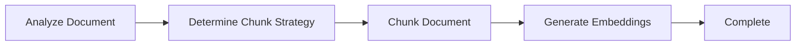
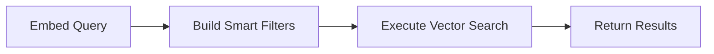

# AI Automation Testing

A RAG (Retrieval-Augmented Generation) based document management and semantic search system with Jira integration. This application enables intelligent document storage, processing, and querying using vector embeddings for automation testing workflows.

## 🏗️ Architecture

- **Backend**: FastAPI REST API
- **Frontend**: Streamlit web interface  
- **Agent Framework**: LangGraph for agentic workflows
- **Document Storage**: MongoDB with GridFS
- **Vector Database**: Pinecone
- **Embeddings**: Pinecone Llama-text-embed-v2 (1024 dimensions)
- **External Integration**: Jira REST API

## ✨ Features

### Document Management
- 📤 Upload documents (.pdf, .docx, .txt) to MongoDB GridFS
- 🏷️ Tag and annotate files with custom metadata
- 📋 Search and filter files by name/tags
- 💾 Download and delete stored documents
- 🔒 Optional token-based authentication

### Text Processing Pipeline
- 📄 Extract text from PDF, DOCX, and TXT files
- ✂️ Configurable text chunking with overlap
- 🧠 Generate embeddings using Pinecone's inference API
- ⚠️ Advanced error handling (encrypted PDFs, corrupted files, unsupported formats)

### Semantic Search (RAG)
- 🔍 Vector similarity search with metadata filtering
- 📊 Configurable namespaces and top-k results
- 📈 Relevance scoring for matched chunks
- 🎯 Filter by source, filename, or custom metadata
- 🤖 **LangGraph Agent**: Intelligent document processing workflow
  - Automatic chunking strategy selection
  - Context-aware query processing
  - Multi-step reasoning for optimal results

### Jira Integration
- 🔗 Query Jira issues via REST API
- 🔎 JQL (Jira Query Language) search support
- 🏷️ Combine Jira metadata with vector search

## 📦 Installation

### Prerequisites
- Python 3.10+
- MongoDB instance
- Pinecone account and API key
- Jira account (optional, for integration features)

### Setup

1. **Clone the repository**
   ```bash
   git clone <repository-url>
   cd Ai_Automation_testing-main
   ```

2. **Install dependencies**
   ```bash
    Create virtual environment 
    python -m venv venv

    ./.venv/Scripts/activate

    upgrade pip for faster installation 
    python -m pip install --upgrade pip setuptools wheel

    install requirements.txt files
    pip install -r requirements.txt

    ## Setup (using uv)
    install uv first add uv.exe path at system environment

    uv venv
    ./.venv/Scripts/activate  # or Windows equivalent
    uv pip install -r requirements.txt

   ```

3. **Configure environment variables**
   
   Create a `.env` file in the project root:
   ```env
   # Pinecone Configuration
   PINECONE_API_KEY=your_pinecone_api_key
   PINECONE_INDEX=your_index_name
   PINECONE_EMBED_MODEL=llama-text-embed-v2
   PINECONE_EMBED_DIM=1024
   PINECONE_API_VERSION=2025-10
   PINECONE_CLOUD=aws
   PINECONE_REGION=us-east-1
   
   # MongoDB Configuration
   MONGODB_URI=mongodb://localhost:27017
   MONGODB_DATABASE=ai_testing
   
   # API Authentication (Optional)
   API_AUTH_TOKEN=your_secret_token
   
   # Backend URL
   BACKEND_BASE_URL=http://localhost:8000
   FRONTEND_ORIGIN=http://localhost:8501
   
   # Jira Configuration (Optional)
   JIRA_URL=https://your-domain.atlassian.net
   JIRA_USERNAME=your-email@example.com
   JIRA_API_TOKEN=your_jira_api_token
   ```

## 🚀 Usage

### Start the Backend Server

```bash
cd Backend
uvicorn main:app --reload --port 8000
```

The API will be available at `http://localhost:8000`

### Start the Frontend Application

```bash
cd Frontend
streamlit run app.py
```

The web interface will open at `http://localhost:8501`

## 📚 API Endpoints

### Health Check
```
GET /health
```

### File Management

**Upload File**
```
POST /files/upload
Content-Type: multipart/form-data

Parameters:
- file: File (required)
- tags: string (comma-separated)
- notes: string
- token: string (if authentication enabled)
```

**List Files**
```
POST /files/list
Content-Type: application/json

Body: {
  "name_contains": "optional_string",
  "tag_contains": "optional_string", 
  "limit": 100
}
```

**Download File**
```
GET /files/download/{file_id}
```

**Delete File**
```
DELETE /files/{file_id}
```

### Vector Operations

**Embed & Upsert to Pinecone**
```
POST /pinecone/embed-upsert
Content-Type: application/json
Authorization: Bearer <token>

Body: {
  "file_id": "mongodb_file_id",
  "chunk_chars": 1200,
  "chunk_overlap": 150,
  "namespace": "mongodb-files",
  "metadata": {}
}
```

**Query Vector Database**
```
POST /pinecone/query
Content-Type: application/json

Body: {
  "text": "query text",
  "namespace": "mongodb-files",
  "top_k": 5,
  "filter": {"source": {"$eq": "mongodb"}}
}
```

## 🤖 LangGraph Agent Workflows

This project uses **LangGraph** to implement intelligent, agentic workflows for document processing and querying.

### Document Processing Agent

The document processing agent uses a state machine to intelligently process documents:


├── jira_api.py        # Jira REST API client
│       └── langgraph_agent.py # 🤖 LangGraph agentic workflows
**Features:**
- **Automatic Strategy Selection**: Analyzes document characteristics to choose optimal chunking
- **Adaptive Chunking**: Adjusts chunk size based on document length and structure
- **Error Handling**: Graceful error recovery with detailed diagnostics

**Chunking Strategies:**
- `single_chunk`: For documents < 1000 characters
- `section_based`: For structured documents with sections (1500 chars, 200 overlap)
- `fixed_size`: For unstructured documents (1200 chars, 150 overlap)

### Query Agent

The query agent orchestrates intelligent search with multi-step reasoning:



**Features:**
- **Context-Aware Filtering**: Automatically incorporates Jira context
- **Dynamic Filter Building**: Constructs optimal metadata filters
- **Intelligent Ranking**: Combines vector similarity with metadata relevance

## 📂 Project Structure

```
Ai_Automation_testing-main/
├── Backend/
│   ├── main.py                 # FastAPI application
│   ├── Models/
│   │   └── Model.py           # Pydantic models
│   └── utils/
│       ├── MangoDB.py         # MongoDB GridFS operations
│       ├── parse_text.py      # Document text extraction
│       ├── embedding.py       # Pinecone embedding API
│       ├── pinecone_store.py  # Vector database operations
│       ├── chunking.py        # Text chunking utilities
│       ├── filter.py          # Query filtering
│       └── jira_api.py        # Jira REST API client
├── Frontend/
│   └── app.py                 # Streamlit web interface
├── pyproject.toml             # Project dependencies
├── .env                       # Environment variables (create this)
└── README.md                  # This file
```

## 🔧 Configuration

### Chunking Parameters
- **chunk_chars**: Size of text chunks (default: 1200)
- **chunk_overlap**: Overlap between chunks (default: 150)

### Pinecone Settings
- **namespace**: Logical partition in the index (default: "mongodb-files")
- **top_k**: Number of results to return (default: 5)
- **metric**: Distance metric (default: "cosine")

### Supported File Types
- PDF (`.pdf`) - with encryption detection
- Word Documents (`.docx`)
- Text Files (`.txt`)

## 🔐 Authentication

Optional token-based authentication can be enabled by setting `API_AUTH_TOKEN` in your `.env` file. When enabled:
- Include token in form data for upload/delete endpoints
- Use `Authorization: Bearer <token>` header for embed/upsert endpoint

## 🛠️ Error Handling

The system provides specific error types for common issues:
- `UnsupportedFileTypeError`: File format not supported
- `EncryptedFileError`: PDF is password-protected
- `EmptyTextError`: No extractable text in document
- `CorruptedFileError`: File is damaged or unreadable

## 📋 Dependencies

```toml
langgraph >= 0.2.0
langchain-core >= 1.1.0
langchain-openai >= 0.2.0
python-dotenv >= 1.2.1
streamlit >= 1.52.0
fastapi
uvicorn
pymongo
pinecone-client
PyMuPDF (fitz)
python-docx
pydantic
requests
```

## 🤝 Contributing

1. Fork the repository
2. Create a feature branch
3. Commit your changes
4. Push to the branch
5. Open a Pull Request

## 📄 License

This project is provided as-is for automation testing purposes.

## 🐛 Troubleshooting

**Backend not connecting to MongoDB**
- Verify `MONGODB_URI` in `.env`
- Ensure MongoDB is running

**Pinecone dimension mismatch**
- Delete and recreate the Pinecone index with correct dimensions
- Verify `PINECONE_EMBED_DIM=1024` matches your model

**Upload fails with 401**
- Check `API_AUTH_TOKEN` in both backend and frontend `.env` files

**No text extracted from PDF**
- Ensure PDF is not scanned (or enable OCR)
- Check if PDF is encrypted

---

**Built with ❤️ for automated testing workflows**